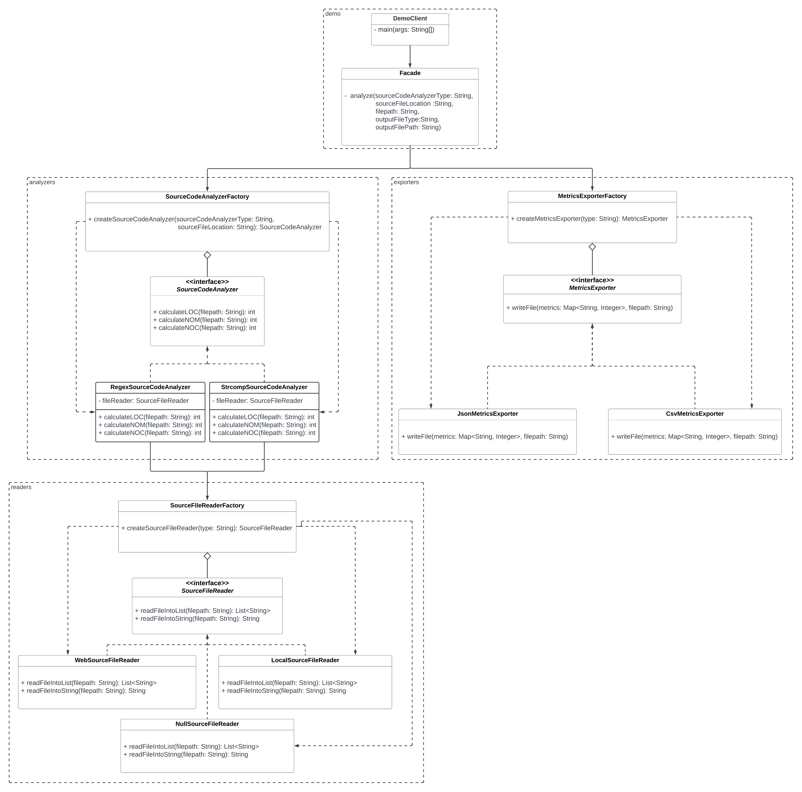

# Source Code Analyzer

A software system that reads a Java source code file that is stored locally or on the web, calculates:

* Lines of Code (LOC)
* Number of Classes (NOC)
* Number of Methods (NOM)

and finally, exports these metrics to an output file.

## How To Build

1. Build the executable Java application with: 

```
mvn package jacoco:report
```

2. Run the executable by executing in the target directory:

```
java –jar “jar-with-dependencies” arg0 arg1 arg2 arg3 arg4
```

were args translate to:<n>

```
arg0 = “JavaSourceCodeInputFile” (e.g., src/test/resources/TestClass.java)<n>
arg1 = “sourceCodeAnalyzerType” [regex|strcomp]<n>
arg2 = “SourceCodeLocationType” [local|web]<n>
arg3 = “OutputFilePath” (e.g., ../output_metrics_file)<n>
arg4 = “OutputFileType” [csv|json]<n>
```
    
*example:*

```
java -jar SourceCodeAnalyzer/target/SourceCodeAnalyzer-0.0.1-SNAPSHOT-jar-with-dependencies.jar SourceCodeAnalyzer/src/main/resources/TestClass.java regex local metrics_results csv
```

This module is designed under the SOLID design principles
---
  
* **S**ingle Responsibility Principle: A class should have one responsibility, one single purpose.
* **O**pen-closed Principle: Software entities should be open for extension but closed for modification.
* **L**iskov Substitution Principle: Objects of a superclass should be replaceable with objects of its subclasses without breaking the application.
* **I**nterface Segregation Principle: Many client-specific interfaces are better than one general-purpose interface.
* **D**ependency Inversion: High-level modules should not depend on low-level modules. Both should depend on abstractions.


Moreover it includes the following design patterns 
---

### Strategy Pattern
  - What is its purpose?  
    Adds support for more than one algorithm/functionality required in many situations
    Specifically in this project:
    1. File reading from different sources.
    2. Calculating metrics with different methods.
    3. Exporting into different types of files.
  - Benefits
    1. Prevents the conditional statements. (switch, if, else…)
    2. The algorithms are loosely coupled with the context entity. They can be changed/replaced without changing the context entity.
    3. Very easy extendible.
  - Disadvantages
    1. Clients must know existence of different strategies and a client must understand how the Strategies differ
    2. It increases the number of objects in the application.
 - Classes that participate
    1. SourceFileReader <-- LocalSourceFileReader, WebSourceFileReader, NullSourceFileReader
    2. MetricsExporter <-- CsvMetricsExporter, JsonMetricsExporter
    3. SourceCodeAnalyzer <-- RegexSourceCodeAnalyzer, StrcompSourceCodeAnalyzer
    
### Factory Pattern
  - What is its purpose?  
    Creating objects without exposing the instantiation logic to the clients
    Providing a common interface to refer to all objects (of a kind)
    Specifically in this project:
    1. Initialize SourceFileReaders, MetricsExporters and SourceCodeAnalyzers based on the source type.
  - Benefits
    1. Separation of concerns: The logic to instantiate classes is separated.
    2. Flexibility: We can extend Product hierarchy without affecting clients.
  - Disadvantages
    1. Factories only cover object creation, not object disposal
    2. Makes code a bit more difficult to understand especially in bigger systems
 - Classes that participate
    1. SourceFileReaderFactory
    2. MetricsExporterFactory
    3. SourceCodeAnalyzerFactory
      
### Facade Pattern
  - What is its purpose?  
    Masks the complexity of the system and hide the implementation details from the client
  - Benefits
    1. Provides a simple interface to a complex system.
    2. De-couples the subsystem for clients and other subsystems, thereby promoting subsystem independence and portability.
 - Classes that participate
    1. Facade
                              
### Null Object Pattern
  - What is its purpose?  
    Covers the case of invalid input
    Specifically in this project:
    1. Covers the case when you pass invalid SourceCodeLocationType (arg2)
  - Benefits
    1. Implements its interface to do nothing. What exactly nothing means depends on what sort of behavior Client expects
    2. Simplifies Client code, because it avoids having to write testing code which handles the null collaborator specially.
  - Disadvantages
    1. It can cause more harm than good by hiding errors and complicating testing.
 - Classes that participate
    1. NullSourceFileReader
    
SourceCodeAnalyzer UML Class Diagram
---

